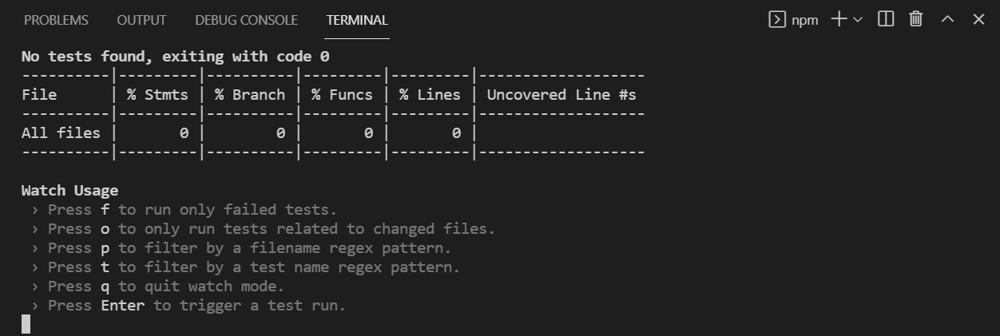
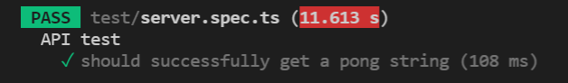
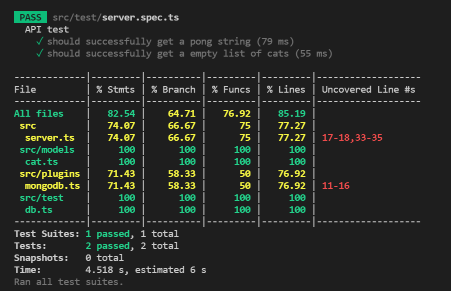
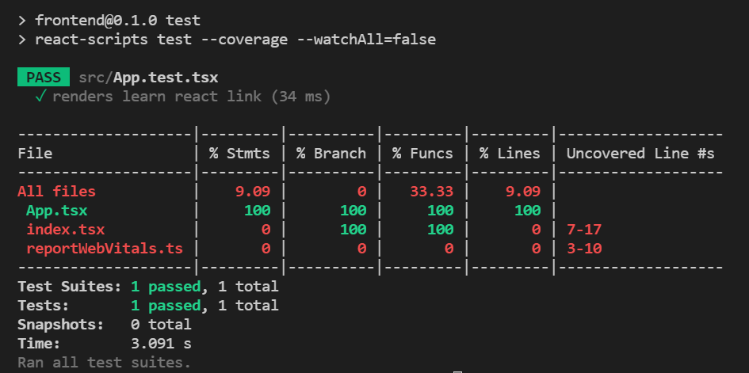

---

theme : "night"
transition: "slide"
highlightTheme: "monokai"
slideNumber: true
title: "TDD - jest"

---

### TDD - jest

<style>
pre {
  background: #303030;
  padding: 10px 16px;
  border-radius: 0.3em;
  counter-reset: line;
}
pre code[class*="="] .line {
  display: block;
  line-height: 1.8rem;
  font-size: 1em;
}
pre code[class*="="] .line:before {
  counter-increment: line;
  content: counter(line);
  display: inline-block;
  border-right: 3px solid #6ce26c !important;
  padding: 0 .5em;
  margin-right: .5em;
  color: #afafaf !important;
  width: 24px;
  text-align: right;
}

.reveal .slides > section > section {
  text-align: center; 
}

h1,h2,h3,h4 {
  text-align: center;
}

p {
  text-align: center;
}
</style>

---

Priambudi Lintang Bagaskara


---

### Outline

- Apa itu testing?
- Kenapa butuh testing?
- Test Driven Development
- Jest 101

---

### Apa itu testing?

--

1. Validasi kode supaya berjalan sesuai ekspektasi.
2. Dilakukan pada fase development, sebelum deployment.

---


### Kenapa butuh testing?

--

1. Membantu mencegah adanya bug.
2. Mengingatkan apabila ada kode yang "tersenggol" saat refactoring.
3. Testing tidak buang-buang waktu, dapat mengurangi biaya development.

---

### Test-Driven Development


---

### Jest 101

--

### Jest

- JavaScript testing framework
- Open Source lead by Facebook
- https://github.com/facebook/jest
- https://jestjs.io/

---

### Start to test
https://github.com/yubinTW/MERN-Simple

---

### backend

--

### jest install

```bash
npm install -D jest ts-jest @types/jest
```
- `jest` - JavaScript testing framework
- `ts-jest` - TypeScript preprocessor for jest
- `@types/jest` - type definition for jest

--

### test file

- \*.spec.\*, \*.test.\*
- js, jsx, ts, tsx, json, node

`todo.spec.ts`

--

### jest config

https://jestjs.io/docs/configuration

create a file - `backend/jest.config.js`
```Javascript=
module.exports = {
  preset: "ts-jest",
  transform: {
    "^.+\\.(t|j)sx?$": "ts-jest",
  },
  testEnvironment: "node",
  moduleFileExtensions: [
    "ts",
    "tsx",
    "js",
    "jsx",
    "json",
    "node",
  ],
  testTimeout: 20000,
  testPathIgnorePatterns: [
    "/node_modules/",
    "/out/"
  ]
}
```

--

### npm script

https://jestjs.io/docs/cli

`backend/package.json`
```json=
"scripts": {
  "test": "jest --verbose --coverage --runInBand",
  "build": "tsc",
  "start": "node out/index.js"
}
```

--

```bash
npm run test
```


---

### create test file

--

create a test folder and file - `src/test/server.spec.ts`

```TypeScript=
import { FastifyInstance } from 'fastify'
import { startFastify } from '../server'
import { Server, IncomingMessage, ServerResponse } from 'http'

describe('API test', () => {
    let server: FastifyInstance<Server, IncomingMessage, ServerResponse>

    beforeAll(async () => {
        // await dbHandler.connect()
        server = startFastify(8888)
    })
    
    // afterEach(async () => {
    //     await dbHandler.clearDatabase()
    // })
    
    afterAll(async () => {
        try {
            // await dbHandler.closeDatabase()
            server.close((): void => { })
            console.log('Closing Fastify server is done!')
        } catch (e) {
            console.log(`Failed to close a Fastify server, reason: ${e}`)
        }
    })

    it('should successfully get a pong string', async () => {
        const response = await server.inject({ method: 'GET', url: '/ping' })

        expect(response.statusCode).toBe(200)
        expect(response.body).toStrictEqual(JSON.stringify({ msg: 'pong' }))
    })
})
```

---

### describe & it

```TypeScript=
describe('API test', () => {
    it('should successfully get a pong string', () => {
        // Some testing condition
    })
})
```


--

```TypeScript=
describe('API test', () => {
    it('should successfully get a pong string', () => {
        // Some testing condition
    })
    it('test B', () => {})
    it('test C', () => {})
    it('test D', () => {})
})
```

--

### expect

```TypeScript=
expect(response.statusCode).toBe(200)
expect(response.body).toStrictEqual(JSON.stringify({ msg: 'pong' }))
```
- `toBe()` - `Object.is`
    - to compare primitive values or to check referential identity of object instances
- `toStrictEqual()`
    - to test that objects have the same types as well as structure

--

https://jestjs.io/docs/expect
```TypeScript=
expect(1 + 2).toBeLessThan(4)
expect(1 + 2).toBeLessThanOrEqual(3)
expect(['A', 'B', 'C']).toContain('B')  
expect(1 + 2).not.toBe(4)
```

--

### Synchronous

```TypeScript=
describe('Math test', () => {
    it('1 + 2 should be 3', () => {
        const a = 1
        const b = 2
        expect(a + b).toBe(3)
    })
})
```

--

### Asynchronous
async & await

```TypeScript=
// pong.ts
async getPong(): Promise<string> {
    return new Promise((resolve) => {
        resolve('pong')
    })
}

// pong.spec.ts
describe('asynchronous test', () => {
    it('get pong', async () => {
        const result = await pong.getPong()
        expect(result).toBe('pong')
    })
    it('still get pong', async () => {
        await expect(pong.getPong()).resolves.toBe('pong')
    })
})
```

---

### in-memory MongoDB

--

install `mongodb-memory-server`
```bash
npm install -D mongodb-memory-server
```

--

create a file - `src/test/db.ts`

```TypeScript=
import mongoose from 'mongoose'
import { MongoMemoryServer } from 'mongodb-memory-server'

const mongod = new MongoMemoryServer()

/**
 * Connect to mock memory db.
 */
export const connect = async (): Promise<void> => {
    await mongod.start()
    const uri = mongod.getUri()

    const mongooseOpts = {
        useNewUrlParser: true,
        autoReconnect: true,
        reconnectTries: Number.MAX_VALUE,
        reconnectInterval: 1000,
        poolSize: 10
    }

    await mongoose.connect(uri, mongooseOpts)
}

/**
 * Close db connection
 */
export const closeDatabase: () => Promise<void> = async () => {
    await mongoose.connection.dropDatabase()
    await mongoose.connection.close()
    await mongod.stop()
}

/**
 * Delete db collections
 */
export const clearDatabase: () => Promise<void> = async () => {
    const collections = mongoose.connection.collections

    for (const key in collections) {
        const collection = collections[key]
        await collection.deleteMany({})
    }
}
```

--

`src/test/server.spec.ts`
```TypeScript=
import { FastifyInstance } from 'fastify'
import { startFastify } from '../server'
import { Server, IncomingMessage, ServerResponse } from 'http'
import * as dbHandler from './db'

describe('API test', () => {
    let server: FastifyInstance<Server, IncomingMessage, ServerResponse>

    beforeAll(async () => {
        await dbHandler.connect()
        server = startFastify(8888)
    })
    
    afterEach(async () => {
        await dbHandler.clearDatabase()
    })
    
    afterAll(async () => {
        try {
            await dbHandler.closeDatabase()
            server.close((): void => { })
            console.log('Closing Fastify server is done!')
        } catch (e) {
            console.log(`Failed to close a Fastify server, reason: ${e}`)
        }
    })

    it('should successfully get a pong string', async () => {
        const response = await server.inject({ method: 'GET', url: '/ping' })

        expect(response.statusCode).toBe(200)
        expect(response.body).toStrictEqual(JSON.stringify({ msg: 'pong' }))
    })

    it('should successfully get a empty list of cats', async () => {
        const response = await server.inject({ method: 'GET', url: '/cats' })

        expect(response.statusCode).toBe(200)
        expect(response.body).toStrictEqual(JSON.stringify({ cats: [] }))
    })
})
```

--



--

### Exercise

Write a test case for the POST API `/cats`
```TypeScript=
// Hint: your request should contain a payload content
{ 
    method: 'POST', 
    url: '/cats',
    payload: {
        name: catName
    } 
}
``` 

---

### frontend

--

### npm script

`frontend/package.json`
```json=
"scripts": {
  "start": "react-scripts start",
  "build": "react-scripts build",
  "test": "react-scripts test --coverage --watchAll=false --runInBand",
  "eject": "react-scripts eject"
}
```

--

```bash
npm run test
```


--

### jest config

add `jest` block to `frontend/package.json`
```json=
{
  {
  ...
  },
  "jest": {
    "collectCoverageFrom": [
      "src/**/*.{ts,tsx}",
      "!src/reportWebVitals.ts",
      "!src/index.tsx",
      "!src/react-app-env.d.ts"
    ]
  }
}
```

--


---

### test case

https://jestjs.io/docs/tutorial-react

`src/App.test.tsx`
```typeScript=
import React from 'react';
import { render, screen } from '@testing-library/react';
import App from './App';

test('renders learn react link', () => {
  render(<App />);
  const linkElement = screen.getByText(/learn react/i);
  expect(linkElement).toBeInTheDocument();
});
```

---

### source code
https://github.com/mdes4214/MERN-Simple

---

### jest-extended

https://github.com/jest-community/jest-extended


